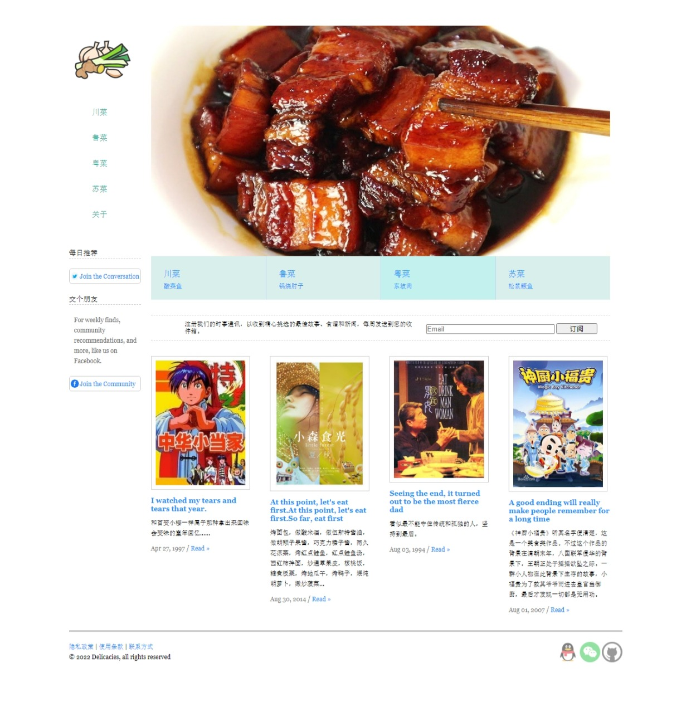

# 珍馐
- 结构：less+响应式媒体查询布局

- 截图:ice_cream:

  

- 演示地址:ocean:：https://vogadero.github.io/Delicacies/

# Tree🌵    
```
珍馐-less+响应式媒体查询布局
├─ .history
│  ├─ README_20220501232117.md
│  └─ README_20220504142904.md
├─ css
│  ├─ index.css
│  ├─ index.less
│  ├─ jquery.popuplayer.min.css
│  ├─ reset.css
│  └─ reset.less
├─ images
│  ├─ 01.jpg
│  ├─ 02.jpg
│  ├─ 03.jpg
│  ├─ 04.jpg
│  ├─ facebook.png
│  ├─ favicon.ico
│  ├─ github.png
│  ├─ index.jpeg
│  ├─ logo.png
│  ├─ pic1.png
│  ├─ pic2.png
│  ├─ pic3.png
│  ├─ pic4.png
│  ├─ QQ.png
│  ├─ 微信.png
│  └─ 推特.png
├─ index.html
├─ js
│  ├─ jquery-3.2.1.js
│  ├─ jquery.popuplayer.min.js
│  └─ rollPic.js
└─ README.md
```